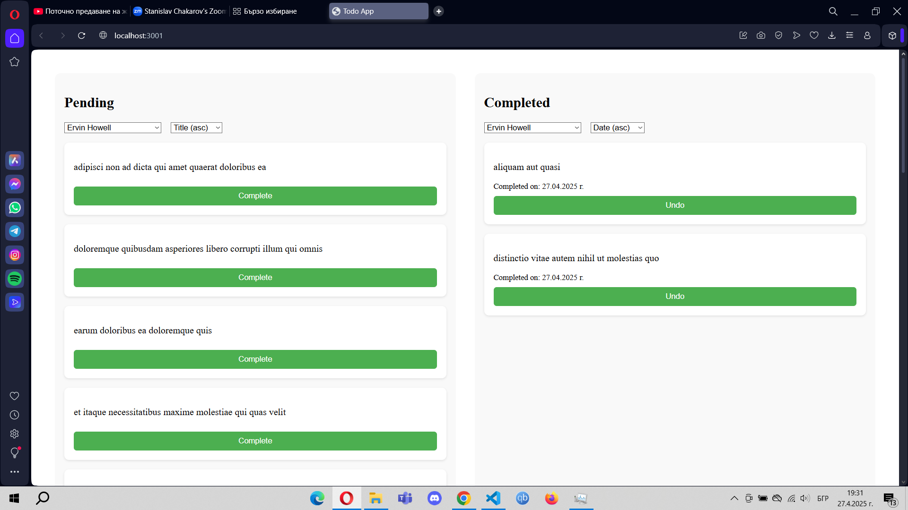

# Todo React App

This is a simple **Todo Application** built with **React**.

It allows you to:
- View uncompleted and completed todos
- Filter todos by user
- Sort todos alphabetically or by completion date
- Mark todos as completed and move them back if needed
- Load more todos with a button (pagination)

---

## Screenshot



*(You should add a screenshot of the running app here after uploading it to GitHub.)*

---

## Technologies Used

- React
- JavaScript (ES6+)
- HTML5
- CSS3
- [JSONPlaceholder API](https://jsonplaceholder.typicode.com/)

---

##  Installation

First, make sure you have **Node.js** and **npm** installed on your computer.

1. Clone the repository:
   ```bash
   git clone https://github.com/your-username/todo-react-app.git

2. Navigate into the project directory:
   cd todo-react-app

3. Install dependencies:
   npm install

4. Start the development server:
   npm start

The app will open at http://localhost:3000/ automatically!
